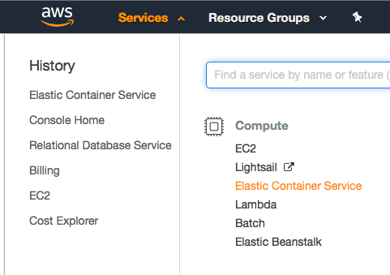
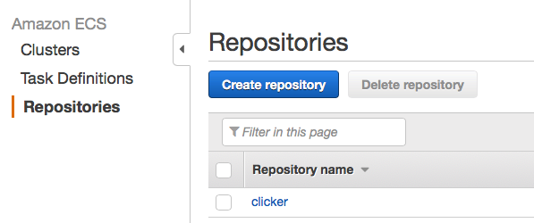
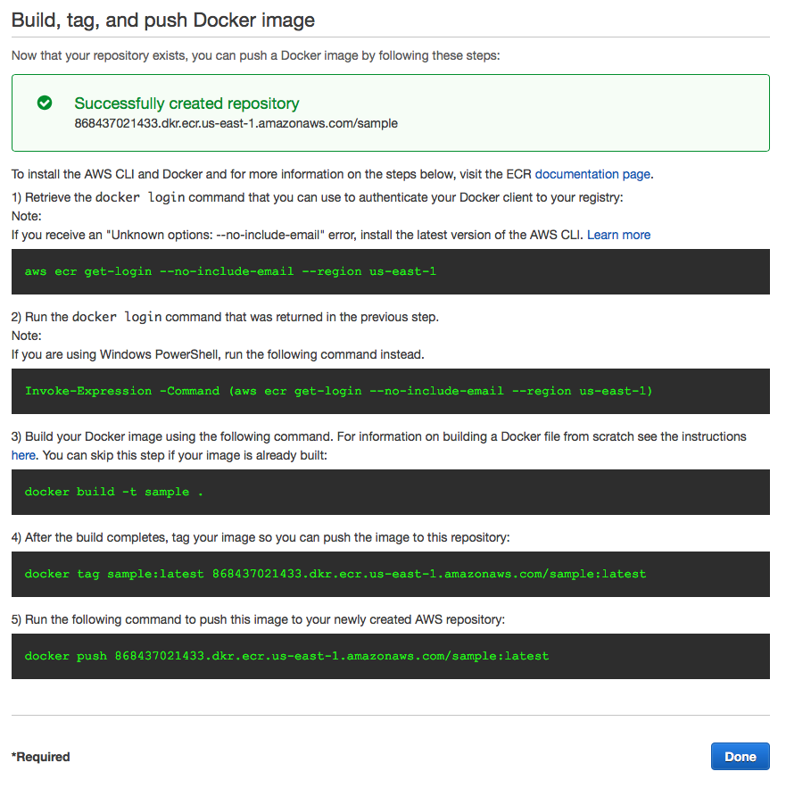
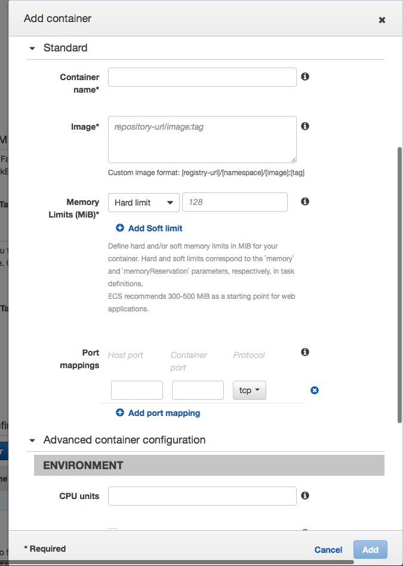
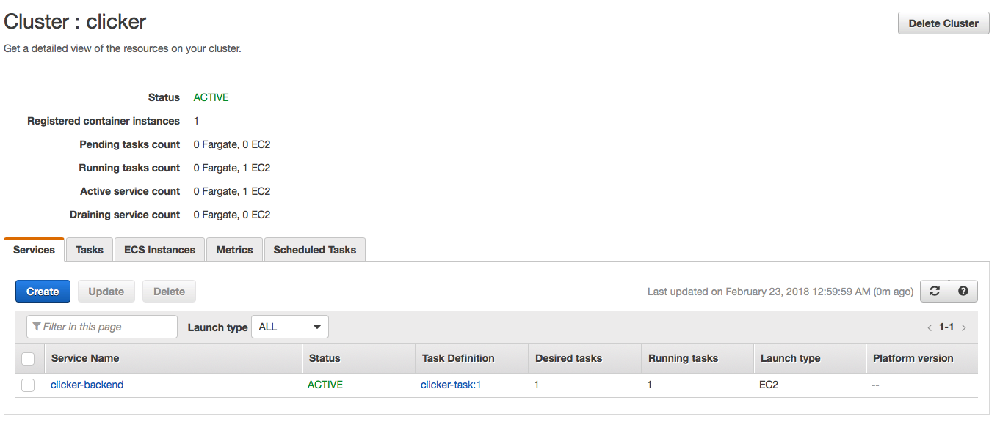
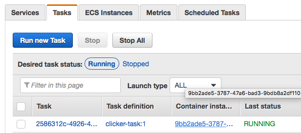

# Deployment

The following `README` articulates how to deploy your service on AWS using Docker.

1. Install the [`Amazon CLI`](https://docs.aws.amazon.com/cli/latest/userguide/installing.html)
2. Install [`Docker`](https://docs.docker.com/install/)

__3. Create a Dockerfile for the app you want to upload__

There is an example Dockerfile in this directory for node-js deployment, but the image
should be tailored to the specific use case.

__4. Test your docker image by creating a docker container for that image, and verify that it runs__

Even though the image built successfully, there could still be errors with scripts that
run, i.e. `webpack`, environment variables not being properly set. 

There is an example docker-compose.yml file in the directory. To run it, run `docker-compose up` in 
this directory.

Errors on the server are much more difficult to debug, so it is advised to test that
everything works properly before proceeding.

__5. Upload the image to ECS__

Next, we need to upload the Docker image that we created to the ECS registry.
You can read more about Docker images [`here`](https://docs.docker.com/engine/docker-overview/)

First, navigate to the ECS registry, listed under AWS services.

Next, create a new repository by navigating to the Repositories section.

After filling in the name of the image, just follow the commands to upload and point your image
to the AWS servers.

__6. Create a Task Definition__

Next, navigate to the *Task Definitions* section on the left sidebar, and create a new task definition.

It's recommended you use an EC2 instance, since the Fargate instances don't support any port forwarding.

In Step 2, after filling in the name of the task, under *Container Definitions*, click on *Add Container*.

Here, you can specify the container settings (which should be very similar to the docker-compose file)
created earlier.

The *Port Mappings* section allows you to forward traffic from ports such as 80 to 3000/8000, or whichever
port your app might be running on.

Environment variables, if necessary, should be set in the *ENVIRONMENT* section as well.

__7. Create the Cluster__

Navigate to the  *Clusters* section on the left sidebar, and create a cluster for your tasks. 

If you have multiple tasks that are under the same app (i.e. a backend and a webapp that are separate 
but are for the same application), they should go under the same cluster.

Create a cluster with `EC2 Linux + Networking`, and set the name and EC2 instance type (I would recommend
t2-medium if you're not sure). 

The key-pair is optional, since we already tested our containers with `docker-compose up`.

__8. Create Services__

Finally, click into your cluster.

Create a new service, and set the launch type to `EC2`. Set the number of tasks to 1, and the Service Name
to something reasonable. Finally, your container should be deployed as an EC2 instance!

Set the *minimum healthy percent* to 0 –– this is so when you want to update the service AWS can safely stop it and redeploy.

If you navigate to the tasks section, and click on Container instance, you should be able to see the public
IP for your container. 

__9. Updating the Service__

If you ever need to push an update, upload a new docker image to the ECS repository (similar to step 5). Then, click on __update__ on the service you want to update, and press __Force New Redeployment__. 

You don't have to create a new task, since on redeployment a new image is pulled. However, if you change environment variables, you need to create a new task first.

`:)`
