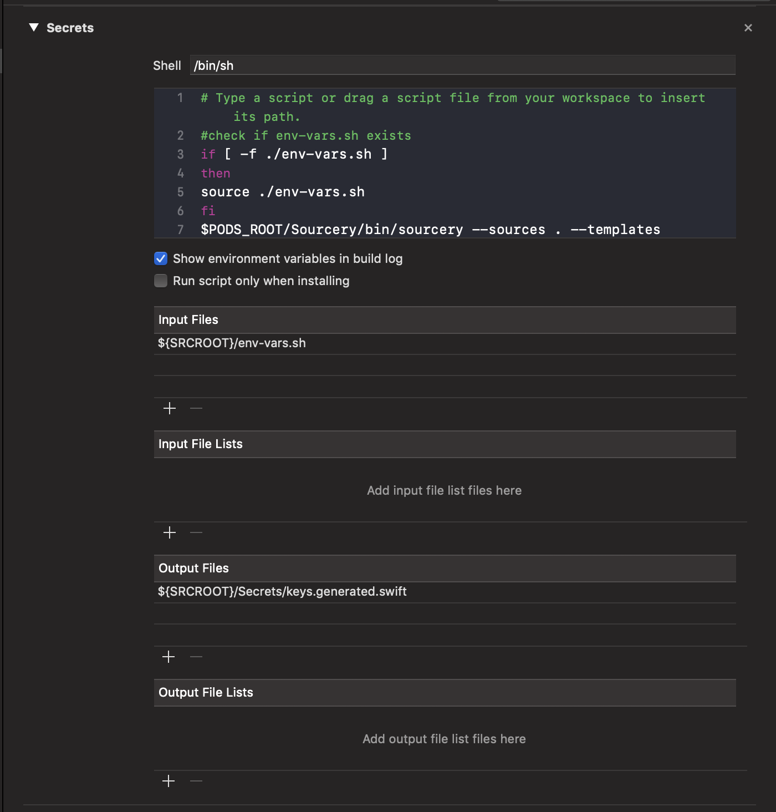

# SwiftLint

Linting is important and we want to adapt a uniform linter across all iOS projects.


### SwiftLint Installation

To use swiftlint, we just have to install it with brew. In terminal, run:

```text
brew install swiftlint
```


### Configure With Xcode

Integrate SwiftLint into an Xcode scheme to get warnings and errors displayed in the IDE. Just add a new "Run Script Phase" with:

```bash
if which swiftlint >/dev/null; then
  swiftlint
else
  echo "warning: SwiftLint not installed, download from https://github.com/realm/SwiftLint"
fi
```



### Adding a swiftlint.yml

This file will control the rules and how the the swiftlint framework will operate. In the root directory of the project, create a new file called `.swiftlint.yml`

A swiftlint.yml defines all the rules we want to use/ignore when linting. Here is a good starting file, but feel free to modify it as needed. Make sure you replace YOUR\_PROJECT\_FOLDER with your project folder name.

```yaml
disabled_rules: # rule identifiers to exclude from running
  - variable_name
  - nesting
  - function_parameter_count
opt_in_rules: # some rules are only opt-in
  - control_statement
  - empty_count
  - trailing_newline
  - colon
  - comma
included: # paths to include during linting. `--path` is ignored if present.
  - YOUR_PROJECT_FOLDER
excluded: # paths to ignore during linting. Takes precedence over `included`.
  - Pods
  - YOUR_PROJECT_FOLDER/R.generated.swift

# configurable rules can be customized from this configuration file
# binary rules can set their severity level
force_cast: warning # implicitly. Give warning only for force casting

force_try:
  severity: warning # explicitly. Give warning only for force try

type_body_length:
  - 300 # warning
  - 400 # error

# or they can set both explicitly
file_length:
  warning: 500
  error: 800

large_tuple: # warn user when using 3 values in tuple, give error if there are 4
   - 3
   - 4
   
# naming rules can set warnings/errors for min_length and max_length
# additionally they can set excluded names
type_name:
  min_length: 4 # only warning
  max_length: # warning and error
    warning: 30
    error: 35
reporter: "xcode"
```

You can read more about swiftlint rules [here](https://github.com/realm/SwiftLint/blob/master/Rules.md).

### SwiftLint Autocorrect - Git Commit

One of the cool features swiftlint is autocorrect. SwiftLint can automagically fix simple issues with your code. To run this, just go into the root directory on termial and run `swiftlint autocorrect`

To make this even easier, we can add a rule to run autocorrect on each git commit.

1. Go to the root directory of the project in terminal
2. run `cd .git/hooks`
3. create a new file by running `touch pre-commit` 
4. run `vim pre-commit` 
5. Add the following into the file:

```bash
#!/bin/sh
git diff --cached --name-only | grep .swift | while read filename; do
    /usr/local/bin/swiftlint autocorrect --path "$filename"
done
```

Now on every git commit, swiftlint will run. This is awesome!

