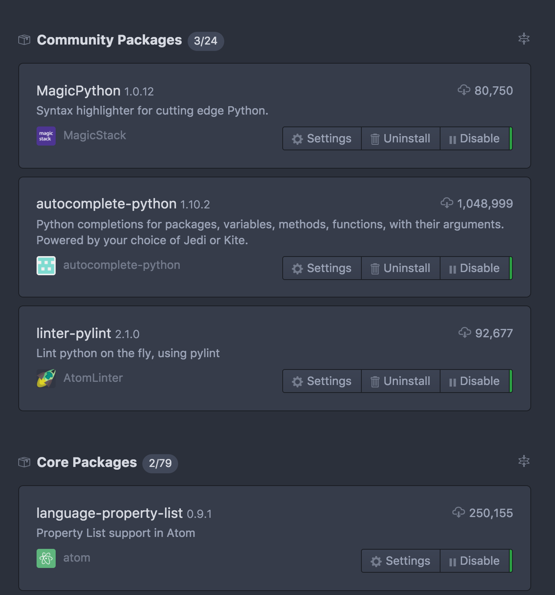

# Python

The following `README` articulates how to setup your development environment for development with `Python` for `AppDev`-related projects.

1. Download [`Atom`](https://atom.io/)
2. Install [`Nuclide`](https://nuclide.io/)
3. Check this box in the `Nuclide` options screen:


... and restart `Atom`
4. Add the following to the bottom of your `config.cson` for `Atom`, found by going to `Atom > Config...`:

````cson
".python.source":
  editor:
    tabLength: 2
````

5. Make sure the following packages are downloaded (install them if they are not):


