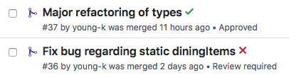
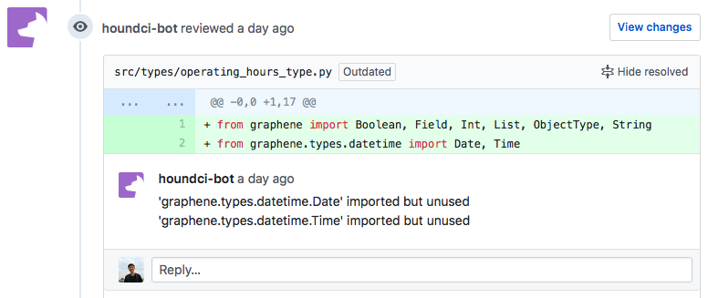

# Continuous Integration

Currently, we use two forms of continous integration: **HoundCI** and **TravisCI.**   
  
Both are primarily used as checks that are run when a pull-request is created, and have ✅ or ❌to denote whether the checks have passed or not. 



## HoundCI

HoundCI serves as a way for code to be linted when a pull request is created. HoundCI runs on the new code added, leaving comments if code does not follow the styling guidelines.



Rules are defined in a `.hound.yml` file at the root of the repository, and a sample one might look like:



```yaml
flake8:
  enabled: true
  config_file: .flake8.ini
```



The above one tells HoundCI to lint using `flake8` \(a `python` linter\) and points to `.flake8.ini` as the configuration file.



```text
[flake8]
ignore = E111,E114,E302
exclude = .git,__pycache__,venv
max-line-length = 100
```



To configure HoundCI for a repository, the Backend Lead should enable it [here](http://houndci.com), and once it is enabled, HoundCI will begin running checks as long as a `.hound.yml` file exists.

## TravisCI

TravisCI is primarily used on AppDev as a way of running unit tests in a given repository. Although as developers we write unit tests, it's easy to forget to run them every single time we create a new feature.

TravisCI allows us to automate this by running tests based on a `.travis.yml` file at the root of the repository. A sample one for [pollo-backend](https://github.com/cuappdev/pollo-backend) is below:



```yaml
language: node_js
sudo: required
node_js:
    - '10'
services:
    - postgresql
addons:
    postgresql: '9.6'
before_install:
    - psql --host=localhost -c 'CREATE DATABASE clicker;' -U postgres
env:
  global:
    - CHRONICLE_ACCESS_KEY='' CHRONICLE_SECRET_KEY='' DB_HOST='localhost' DB_USERNAME='postgres' DB_PASSWORD='' DB_NAME='clicker' GOOGLE_CLIENT_ID='?'
        GOOGLE_CLIENT_SECRET='?' GOOGLE_REDIRECT_URI='?'
script:
    - npm run start &
    - sleep 10; npm run test
```



TravisCI can also run more complex scripts, and we also use TravisCI to push Docker images for deployment.

To configure HoundCI for a repository, the Backend Lead should enable it [here](http://houndci.com), and once it is enabled, HoundCI will begin running checks as long as a `.travis.yml` file exists.

