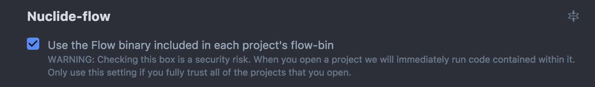

# JavaScript

The following `README` articulates how to setup your development environment for client-side and server-side development with `JavaScript` for `AppDev`-related projects.

## Client-Side

For client-side development, we will be using `ES6` syntax with [`Flow`](https://flow.org/) type-checking our code. In addition, we will have  
a linter run through [`Atom`](https://atom.io/).

Before we start, the following `devDependencies` are required:

```javascript
{
  "babel-cli": "*",
  "babel-jest": "*",
  "babel-preset-flow": "*",
  "flow-bin": "*",
}
```

For convenience:

```text
npm install --save-dev babel-cli babel-jest babel-preset-flow flow-bin
```

**NOTE:** All `ES6`-related transpiling-, `Babel`, and `Webpack`-related things should be configured by someone who knows what they're doing. If you are having issues, seek the leads' help.

1. Download [`Atom`](https://atom.io/)
2. Install [`Nuclide`](https://nuclide.io/)
3. Check this box in the `Nuclide` options screen:


... and restart `Atom`

1. Point `Nuclide` to use the project's local `Flow` `bin` directory.  Go to `Nuclide`'s options page in `Atom`, find the `Nuclide-flow` settings, and check the following box:



1. Ensure your `.babelrc` looks something like this:

```javascript
{
  "presets": [
    // Other presets
    "flow",
  ]
}
```

1. Install [`ESLint Atom Plugin`](https://github.com/AtomLinter/linter-eslint)
2. Clone this repo and `npm install` in the `js` directory to setup your global `ESLint` config.
3. Point your `ESLint Atom Plugin` to the directory containing this repo in the following way:

   

## Server-Side

Essentially the same as above, but with a slightly different `Webpack` config. Ask leads for help if this is not setup already.

## Libraries

To setup our core `js` modules:

```bash
git clone https://github.com/cuappdev/appdev.js.git
cd appdev.js
npm install
npm run build
npm link # Links local NPM module in your global npm config
cd ..
```

Then, you'll be able to run `npm link appdev` in all `AppDev` `JS` projects to have access to the library. Be sure to also add the library to the `[libs]` section of your `.flowconfig`

