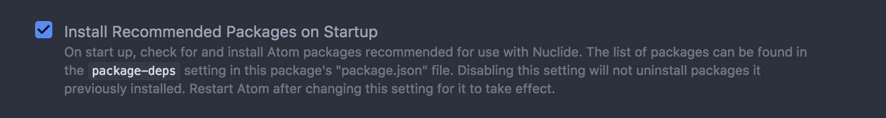

# Python

The following `README` articulates how to setup your development environment for development with `Python` for `AppDev`-related projects.

1. Download [`Atom`](https://atom.io/)
2. Install [`Nuclide`](https://nuclide.io/)
3. Check this box in the `Nuclide` options screen under the "Hyperclick" header:



1. **Uncheck** this box in the `Nuclide` options screen under the "Nuclide-python" header:


1. Restart `Atom`
2. Add the following to the bottom of your `config.cson` for `Atom`, found by going to `Atom > Config...`:

```text
".python.source":
  editor:
    tabLength: 2
```

1. Make sure the following packages are downloaded \(install them if they are not\):


1. Refer the `linter-pylint` package to this directory's `.pylintrc` file:


## Linting

[`Here`](http://docutils.sourceforge.net/sandbox/py-rest-doc/utils/pylintrc) is a great resource for understanding the general format of the `.pylintrc` file. Changes are welcome, so long as they make sense, and `PR`'s are required to make any major changes to linting configs, as this affects how we interact with our code.

